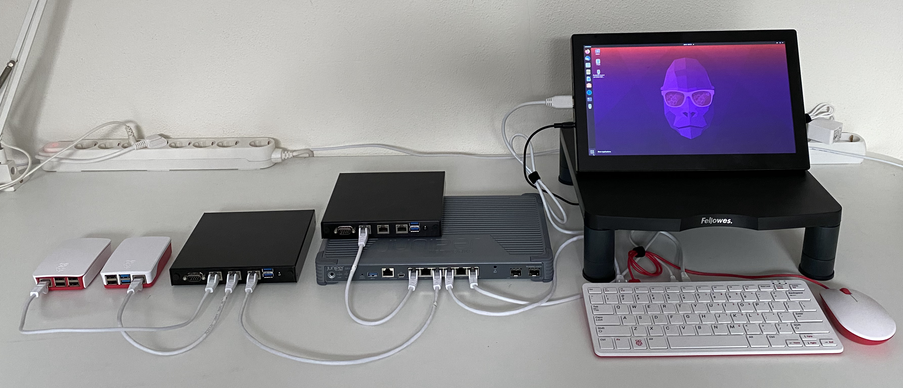

# the QISS-Router project, supported by SIDN-fonds

Welcome to the [github.com/sidn-qiss-router](https://github.com/jdg71nl/sidn-qiss-router) project!

This public repositery contains the `source code` and `documentation` to reproduce the QISS Router 'prototype', that we have been developing in the last 12 months (sep-2020 until sep-2021).

## About QISS

QISS is the "Quality Internet Session System"

### Background on QISS (in NL/Dutch)

Iedereen kent het wel, het haperen, stilstaan of wegvallen van de verbinding wanneer je aan het videobellen bent. Achterliggende reden is dat in het huidige internet (een wereldwijd data-transport netwerk, bestaande uit WiFi en 4G/5G mobiele netwerken, bedrijfsnetwerken en thuisnetwerken) geen Quality of Service bestaat. Met andere woorden, geen garantie dat jouw video-conference gesprek of audio-gesprek niet weggedrukt wordt door andere applicaties. Dit project ontwikkelt een prototype van het QISS systeem. Het QISS systeem bestaat uit een router en software voor op je pc of laptop, die registreert welk verkeer voorrang moet krijgen en dwingt deze transportgarantie ook echt af. 

### About this repository

The QISS-Router prototype at this stage consists of 4 separate programs, that are split into folders:

- `qiss-admin-client`   (=Web-UI in Semantic-UI+React.js)
- `qiss-admin-server`   (=API in Node.js+MongoDB)
- `qiss-user-agent`     (=Python-script to register traffic sessions)
- `qiss-router-daemon`  (=Kernel-module in C)

## About SIDN-fonds

The SIDN-fonds, or 'SIDN Fund', is supporting and funding specific projects that aline with their goals.

Website: https://www.sidnfonds.nl/

SIDN Fund stands for ‘a strong internet for all’. We provide financial support to ideas and projects that aim to make the internet stronger or that use the internet in innovative ways. By doing so, SIDN Fund wants to help increase the social impact of the internet in the Netherlands. SIDN Fund is an independent foundation established by SIDN, the foundation for internet domain registration in the Netherlands. 

Our goals are: 

- A stronger internet
- Empowerment
- Tech for Good

This project site: https://www.sidnfonds.nl/projecten/quality-internet-session-system-qiss

## About John de Graaff

John holds a Master of Science degree (in Electrical Engineering, at the Delft University of Technology), and has 20+ years of experience in the Data Networking field, and is holder of multiple patents (so, inventions), and next to his knowledge on networking protocols and systems, he is also a Software Developer, which capacities he combined in the invention of this QISS system.

## About the Development & Test environment

